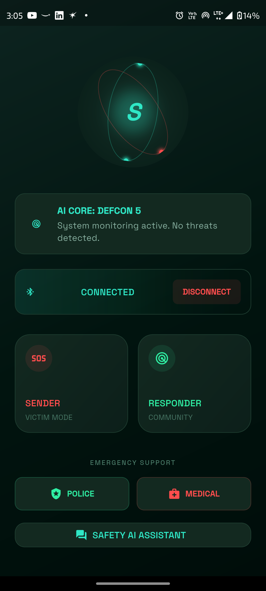

<div align="center">
  
  
  # 🚨 Sentinel Mesh – Smart Women Safety System

  **A multi-layer IoT-based safety network designed to provide real-time emergency detection, offline threat analysis, and rapid alert transmission.**

  [](https://flutter.dev/)
  [](https://reactjs.org/)
  [](https://tailwindcss.com/)
  [](https://www.arduino.cc/)
  [](https://firebase.google.com/)
</div>

---

## 📖 Overview

Women often face safety risks when traveling alone or in unfamiliar areas. Sentinel Mesh addresses this problem by providing a smart wearable safety device. By leveraging a custom ESP32-based hardware wearable, LoRa mesh networking, and an advanced AI engine, Sentinel Mesh acts as your ultimate safety companion.

It provides multiple communication channels so that emergency alerts can still be transmitted even if one network fails.

---

## 🎯 Key Features

- 🆘 **Redundant SOS Trigger**: Activated by pressing the hardware SOS button **three times** or via the mobile app. Sends alerts to predefined contacts, starts live location tracking, and notifies nearby users.
- 📉 **Intelligent Fall Detection**: Automatically triggers an SOS upon detecting falls using an MPU6500 accelerometer and gyroscope. 
  - *Three-step process:* Free fall detection ➔ Impact detection ➔ Immobility confirmation.
- 📍 **GPS Location Tracking**: A NEO-6M GPS module provides real-time location tracking directly from satellites.
- 📡 **Community Responder Radar**: A dedicated Responder Mode alerts nearby community members with a high-priority notification and displays a live radar distance tracker.
- 📹 **Automated Evidence Recording**: When an SOS or heavy impact is confirmed, the mobile app automatically activates the camera to record video/audio evidence.
- 🤖 **AI Safety Chatbot**: An integrated AI Safety Assistant provides real-time guidance, safety tips, and situational advice when users feel insecure.

---

## 🚀 System Workflow

1. **Device Startup**: Power ON ➔ Initialize sensors ➔ Connect to WiFi / GSM ➔ Start LoRa module ➔ System Ready.
2. **Fall Detection**: Free Fall Detected ➔ Impact Detected ➔ Immobility Confirmed ➔ Emergency Alert Triggered.
3. **SOS Button Workflow**: User presses SOS (3 clicks) ➔ Telegram alert sent ➔ Firebase updated ➔ Nearby users notified ➔ LoRa emergency broadcast.
4. **Stop Tracking**: Holding the SOS button for 5 seconds stops tracking.

### 💡 LED Status Indicators

| LED State | Meaning |
|-----------|---------|
| **OFF** | Device starting |
| **ON** | System ready |
| **Blinking** | Emergency triggered |

---

## 🤖 Artificial Intelligence Engine

Sentinel Mesh utilizes a highly redundant, multi-provider AI engine to analyze emergencies in real-time.

- **Groq (Llama 3.3)**: Blazing-fast text-based incident report generation and situational reasoning.
- **Gemini Flash**: Analyzes video/image evidence during an SOS to determine threat severity and weapon presence.
- **YOLO Vision**: On-device machine learning for detecting weapons directly from the live camera feed.
- **Audio AI**: Analyzes ambient sounds (screams, sirens) to provide immediate context.

---

## 📂 Repository Structure

```text
SentinelMesh/
├── 📱 project69-main/              # Flutter Mobile Application
├── 💻 sentinel-web-app/            # React/Vite Web Dashboard
├── 🔌 firmware/SentinelMesh/       # ESP32 C++ Hardware Code
├── ☁️ cloud_functions/             # Firebase Cloud Functions / Backend
└── 🎨 stitch_sentinel_mesh_safety/ # UI Mockups & Design Assets
```

---

## 🛠 Setup & Installation

### 1. Hardware Firmware Setup (Arduino IDE)
1. Open `firmware/SentinelMesh/SentinelMesh.ino`.
2. Install required libraries: `WiFi.h`, `HTTPClient.h`, `TinyGPS++`, `Wire.h`, `SPI.h`, `LoRa.h`.
3. Configure your API keys, APN, and Emergency Contacts in `config.h`.
4. Compile and flash to your ESP32.

### 2. Web Dashboard Setup
```bash
cd sentinel-web-app
npm install
npm run dev
```

### 3. Mobile App Setup
```bash
cd project69-main
flutter pub get
flutter run
```

---

## 🎥 Project Demo Video

Watch the working demonstration of the Sentinel Mesh safety system:
🔗 [Google Drive Demo Video](https://drive.google.com/file/d/1aWKlS43J_iVRKWgZnzqJe0tN3V917Djq/view)

---

## 👩‍💻 Contributors

This project was developed by:
- **Bipladip Saha** – Hardware Integration & ESP32 Programming
- **Anisha Majumdar** – Sensor Integration & Fall Detection System
- **Anwesha Das** – Cloud Integration & Firebase Alert System
- **Bittu Sharma** – Mobile Application Development & Nearby SOS Alert System

---

## 📜 License
This project is developed for academic and research purposes.